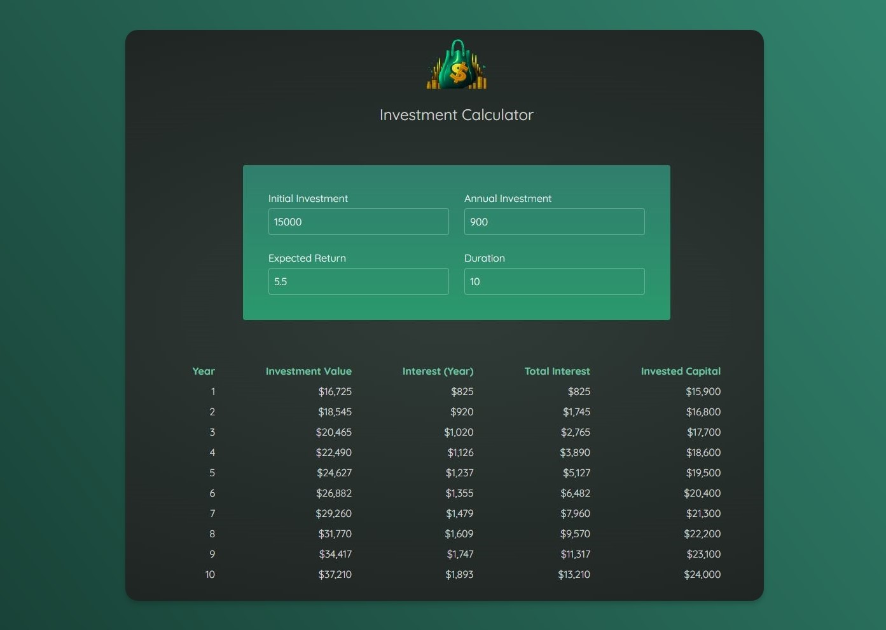

# 💰 Investment Calculator

The **Investment Calculator** is a user-friendly web application designed to help users forecast their investments over time. By entering key details like initial investment, yearly contributions, expected return rate, and investment duration, users can calculate potential returns for the next **N** years.



---

## 🛠️ Technologies Used

This project leverages the following technologies for a modern and efficient web experience:

- **HTML**: Structure and layout of the application.
- **CSS**: Custom styles for aesthetic design.
- **JavaScript (JS)**: Core functionality and interactivity.
- **React**: For building a dynamic and responsive user interface.
- **Vite**: A fast build tool for lightning-fast development and optimized builds.
- **TailwindCSS**: Utility-first CSS framework for clean and responsive styling.

---

## 🌟 Major Features

- **Interactive Input**: Users can input investment details dynamically.
- **Customizable Duration**: Get results for any number of years.
- **Real-Time Calculations**: Instant updates to results as you press Enter.
- **Responsive Design**: Optimized for viewing on all devices.

---

## 🚀 Getting Started

### Prerequisites

Make sure you have the following installed:

- **Node.js** (v14 or above)
- **npm** or **yarn**

### Installation

1. Clone the repository:
   ```bash
   git clone https://github.com/ummamali/investmentcal.git
   ```
